# A/B Testing your ASP.NET Core apps using Azure Container Apps

This repository contains sample code on how to host a set of revisions for your application that have slight differences, useful for performing A/B tests on your site to see how users will respond to changes gradually. You can use Azure App Configuration to create feature flags, then the ASP.NET Core feature flags extensions to change how your app will look or operate when features are enabled or disabled. With Azure Container Apps, you can create multiple revisions for each of your apps. When you put these pieces together, you can ship incremental features and bifurcate traffic so you understand how the changes will impact the app's usability before committing to the change. Then, if you find the change isn't delivering the desired impact for your customers, you can easily scale the "beta" revision back out again. 

* **Frontend** - A front-end web app written using ASP.NET Core Blazor Server. This web app is decorated with feature flags 
* **Monitoring** - A shared project that makes it simple to configure a .NET project with Application Insights monitoring. 
* You'll also see a series of Azure Bicep templates and a GitHub Actions workflow file in the **Azure** and **.github** folders, respectively. 

## What you'll learn

This exercise will introduce you to a variety of concepts, with links to supporting documentation throughout the tutorial. 

* [Azure Container Apps](https://docs.microsoft.com/azure/container-apps/overview) for hosting your app's container images. 
* [GitHub Actions](https://github.com/features/actions) for creating CI/CD workflows to deploy your apps to Azure.
* [Azure Container Registry](https://docs.microsoft.com/azure/container-registry/)
* [Azure Bicep](https://docs.microsoft.com/azure/azure-resource-manager/bicep/overview?tabs=**bicep**) for creating and configuring Azure resources.
* [Azure App Configuration](https://docs.microsoft.com/azure/azure-app-configuration/overview) for setting up feature flags to control the A/B test variance.
* [Kusto](https://docs.microsoft.com/azure/data-explorer/kusto/query/) for building custom queries against the events your A/B tests generate.
* [ASP.NET Core feature flags](https://docs.microsoft.com/azure/azure-app-configuration/use-feature-flags-dotnet-core?tabs=core5x), useful for when you want to test new features or bifurcate functionality for A/B tests.

## Prerequisites

You'll need an Azure subscription and a very small set of tools and skills to get started:

1. An Azure subscription. Sign up [for free](https://azure.microsoft.com/free/).
2. A GitHub account, with access to GitHub Actions.

## Topology diagram

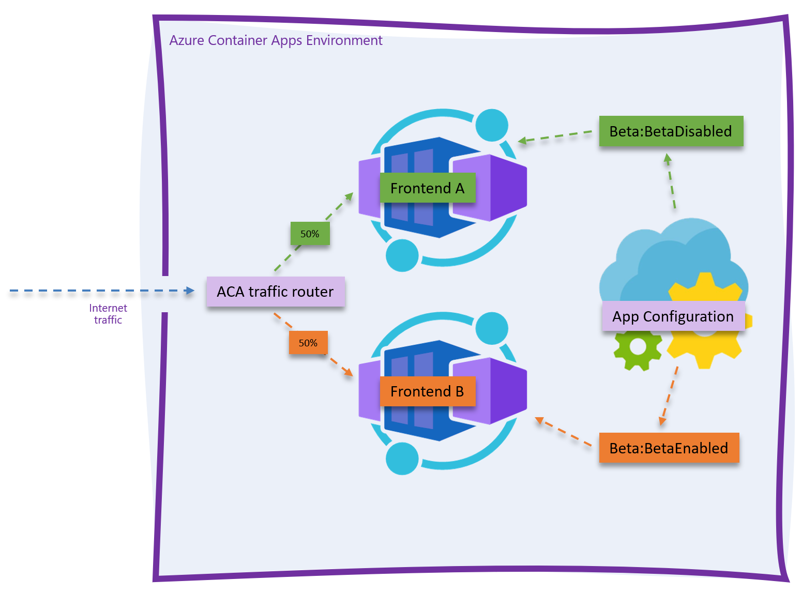

## Setup

By the end of this process you'll have a 2-container app running in Azure Container Apps, with a few supporting resources and an App Configuration instance, which you can use to bifurcate feature settings by revision labels. 

> Note: Remember to clean up or scale back your resources to save on compute costs. 

1. Use the Azure CLI to create an Azure Service Principal, then store that principal's JSON output to a GitHub secret so the GitHub Actions CI/CD process can log into your Azure subscription and deploy the code.
2. Edit the ` deploy.yml` workflow file and push the changes into a new `deploy` branch, triggering GitHub Actions to build the .NET projects into containers and push those containers into a new Azure Container Apps Environment. 

## Authenticate to Azure and configure the repository with a secret

1. Fork this repository to your own GitHub organization.
2. Create an Azure Service Principal using the Azure CLI. 

```bash
subscriptionId=$(az account show --query id --output tsv)
az ad sp create-for-rbac --sdk-auth --name FeatureFlagsSample --role contributor --scopes /subscriptions/$subscriptionId
```

3. Copy the JSON written to the screen to your clipboard. 

```json
{
  "clientId": "",
  "clientSecret": "",
  "subscriptionId": "",
  "tenantId": "",
  "activeDirectoryEndpointUrl": "https://login.microsoftonline.com/",
  "resourceManagerEndpointUrl": "https://brazilus.management.azure.com",
  "activeDirectoryGraphResourceId": "https://graph.windows.net/",
  "sqlManagementEndpointUrl": "https://management.core.windows.net:8443/",
  "galleryEndpointUrl": "https://gallery.azure.com",
  "managementEndpointUrl": "https://management.core.windows.net"
}
```

4. Create a new GitHub secret in your fork of this repository named `AzureSPN`. Paste the JSON returned from the Azure CLI into this new secret. Once you've done this you'll see the secret in your fork of the repository.

   

> Note: Never save the JSON to disk, for it will enable anyone who obtains this JSON code to create or edit resources in your Azure subscription. 

## Deploy the code using GitHub Actions

The easiest way to deploy the code is to make a commit directly to the `deploy` branch. Do this by navigating to the `deploy.yml` file in your browser and clicking the `Edit` button. 

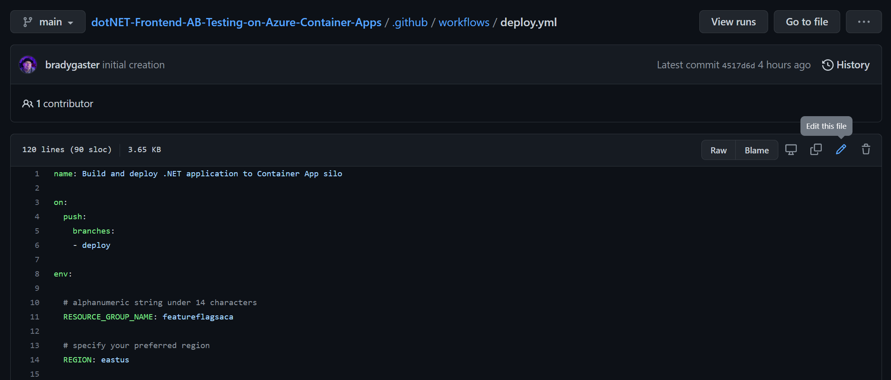

Provide a custom resource group name for the app, and then commit the change to a new branch named `deploy`. 

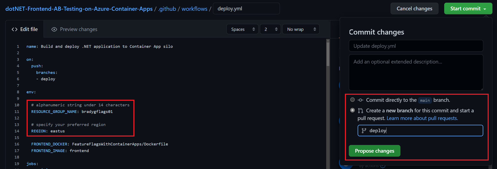

Once you click the `Propose changes` button, you'll be in "create a pull request" mode. Don't worry about creating the pull request yet, just click on the `Actions` tab, and you'll see that the deployment CI/CD process has already started. 

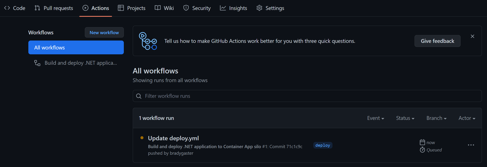

When you click into the workflow, you'll see that there are 3 phases the CI/CD will run through:

1. provision - the Azure resources will be created that eventually house your app.
2. build - the various .NET projects are build into containers and published into the Azure Container Registry instance created during provision.
3. deploy - once `build` completes, the images are in ACR, so the Azure Container Apps are updated to host the newly-published container images. 

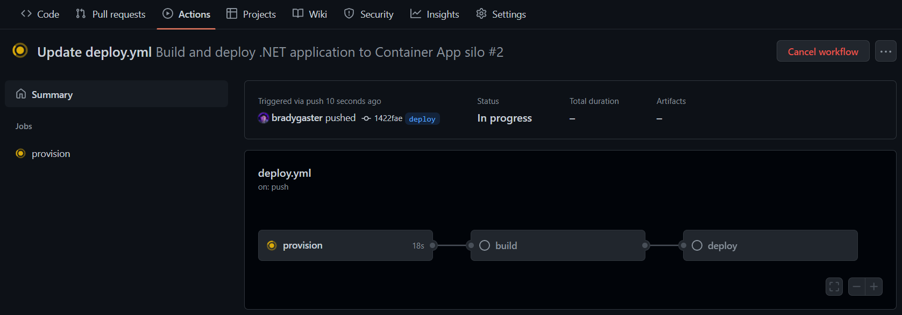After a few minutes, all three steps in the workflow will be completed, and each box in the workflow diagram will reflect success. If anything fails, you can click into the individual process step to see the detailed log output. 

> Note: if you do see any failures or issues, please submit an Issue so we can update the sample. Likewise, if you have ideas that could make it better, feel free to submit a pull request.

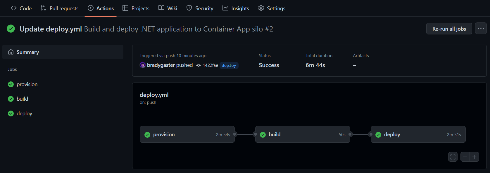

With the projects deployed to Azure, you can now test the app to make sure it works. 

## Quick look at the code

This code is the result of the [Add feature flags to an ASP.NET Core](https://docs.microsoft.com/azure/azure-app-configuration/quickstart-feature-flag-aspnet-core?tabs=core6x%2Ccore5x) app article, which goes a bit more in-depth into the features of Azure App Configuration, so do check those resources out for more information later. For now, take note that there's one change in this repository's code from the original sample code. In `BetaController`, the code from the original sample uses the `FeatureGate` attribute to disable a controller's action in the case that the feature is disabled. In this repository's code, that attribute has been commented out. 

```csharp
public class BetaController : Controller
{
    private readonly IFeatureManager _featureManager;
    private readonly TelemetryClient _telemetryClient;

    public BetaController(IFeatureManagerSnapshot featureManager, TelemetryClient telemetryClient)
    {
        _featureManager = featureManager;
        _telemetryClient = telemetryClient;
    }

    //[FeatureGate(MyFeatureFlags.Beta)]
    public IActionResult Index()
    {
        _telemetryClient.TrackEvent("Beta Page Loaded");
        return View();
    }
}
```

This particular A/B test will be testing the percentage of times the additional navigation link is clicked when it is shown; if the `FeatureGate` attribute is left in, subsequent requests to the `/beta/index` endpoint might 404. Additionally, we've added application insights custom event tracking to the `Index` controller method. This way, each hit to the URL will be tracked with a custom Application Insights event. There's a corresponding Application Insights event in the `_Layout.cshtml` view:

```csharp
<feature name="Beta">
    <li class="nav-item">
        @{
        _telemetryClient.TrackEvent("Beta Menu Shown");
    }
<a class="nav-link text-dark" asp-area="" asp-controller="Beta" asp-action="Index">Beta</a>
    </li>
    </feature>
```

This razor code will also fire an event each time the beta menu item is shown. This way, we know how many opportunities users have to click the link, *and* how many times they actually do click the link and result in a hit on the `beta/index` controller code. 

### Mapping configuration to feature enablement

We know the .NET code will be deployed as a container artifact, so the best presumption we can make that we'll have to customize the deployment and to enable or disable features is environment variables. Since top-level string variables in `appsettings.json` easily map to environment variables you can set on an Azure Container App using either Bicep, the Azure CLI, Visual Studio, or the Azure Portal, the code has a `RevisionLabel` variable that maps to an Azure App Configuration feature flag. 

```json
{
  "Logging": {
    "LogLevel": {
      "Default": "Information",
      "Microsoft.AspNetCore": "Warning"
    }
  },
  "ApplicationMapNodeName": "Frontend",
  "AllowedHosts": "*",
  "RevisionLabel": "BetaDisabled"
}
```

In the Azure App Configuration blade, however, you'll see that the `RevisionLabel` associated with the feature's <u>enablement</u> is `BetaEnabled`, not `BetaDisabled`, which is the default in the code. 

> The idea here is that you need to *enable* the feature specifically. Any value in the configuration or environment variable <u>other than</u> `BetaEnabled` will result in the Beta menu item being invisible. 

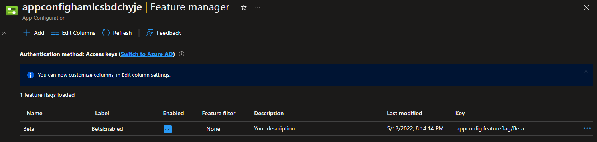

## Try the app in Azure

The `deploy` CI/CD process creates a series of resources in your Azure subscription. These are used primarily for hosting the project code, but there's also a few additional resources that aid with monitoring and observing how the app is running in the deployed environment. 

| Resource          | Resource Type                    | Purpose                                                      |
| ----------------- | -------------------------------- | ------------------------------------------------------------ |
| appconfig`suffix` | App Configuration                | Provides distributed configurability for your cloud-native apps, and enables feature flagging and enablement. |
| `prefix`ai        | Application Insights             | Enables telemetry and inside-out analysis of your application, provides views on custom events you fire during the application's execution, exception telemetry. |
| frontend          | Azure Container App              | Houses the .NET Blazor Server app representing the frontend of the app. |
| `prefix`env       | Azure Container Apps Environment | A compute environment in which your application's containers can run and communicate with one another internally. |
| `prefix`acr       | Azure Container Registry         | Where your container images are stored and deployed from whenever you create a new container app or container app revision. |
| `prefix`logs      | Log Analytics Workspace          | All `ILogger<T>` data you log within the application ends up being stored in this space, as well as system and console data emitted by the container images. |

Once the application code is deployed, the Azure resource group into which it is deployed looks something like this. 

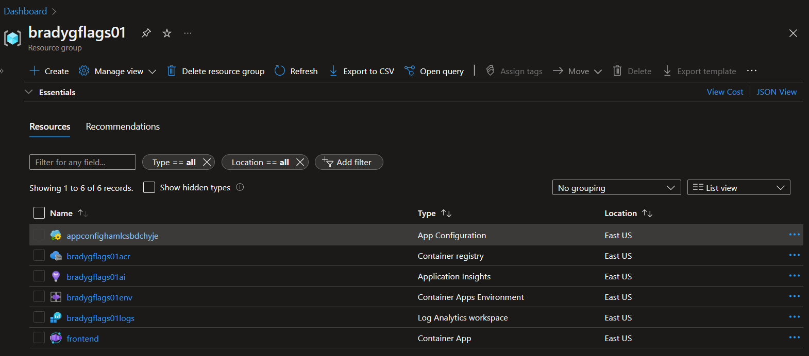

## Add a revision that enables the Beta feature

From looking at the code, you know that setting the `RevisionLabel` environment variable (or app setting) to `BetaEnabled` results in the beta menu feature being activated. Now, you'll create a new Azure Container App revision, and split traffic between the two revisions so you can track how many requests you have to the new feature once customers are given an opportunity to see the new feature. After the deployment, going to the `frontend` resource in the portal, you'll see 2 revisions, one of which is active. 

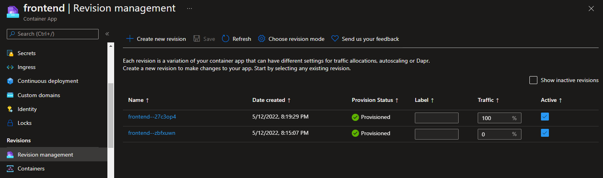

The one receiving 0% of the traffic is the original image - the ACA Welcome Image - that's deployed when the container apps are first created. You can uncheck that one and save it, resulting in there being 1 active revision. The one receiving 100% of the traffic is our actual app's image. 

Click the `Create new revision` button, and create a new revision. But this time, change the `RevisionLabel` value to be `BetaEnabled` instead of the default. Also, it'd be a good idea to give this new revision a logical suffix name. This way you know this is the one with the feature flag turned `on`. 

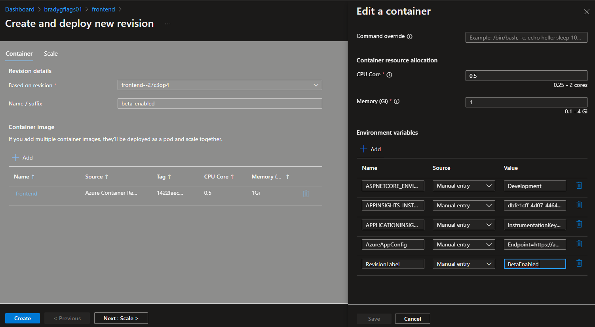

Click the `Create` button to create the revision. A few moments later it will complete deployment. 

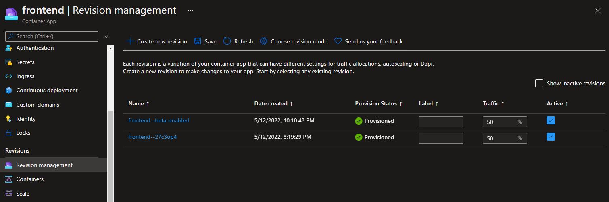

Now, about half of the requests to the app result in an additional menu item being displayed. 


## Monitoring

As site visitors are shown the beta menu item, events are recorded, and when the page resulting on their click is loaded, a separate event is recorded. Since each event is recorded individually by Application Insights, you have a snapshot of the distribution of opportunities to how many successful requests are made as a result of the menu item. 

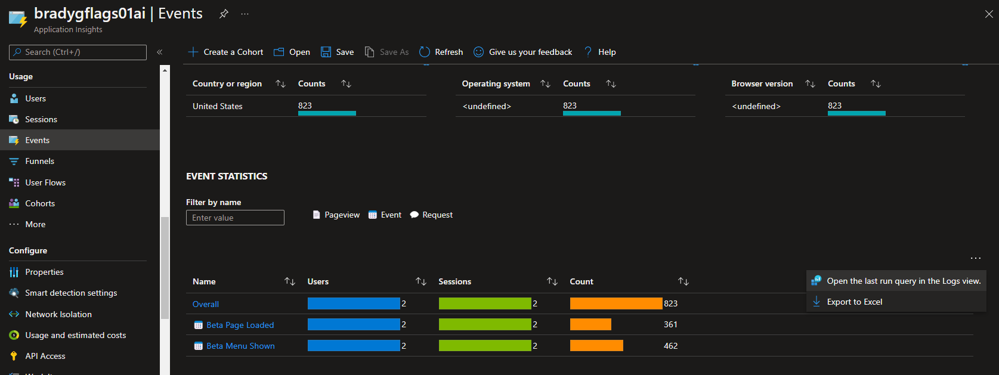

From the screenshot you'll see how clicking the ellipse results in being able to customize the query. A rather complex Kusto query is shown next, but you can distil the query down to whatever minute level of detail you're after, or even use Kusto's chart-rendering capabilities to show the opportunity-versus-success telemetry for the A/B test. 

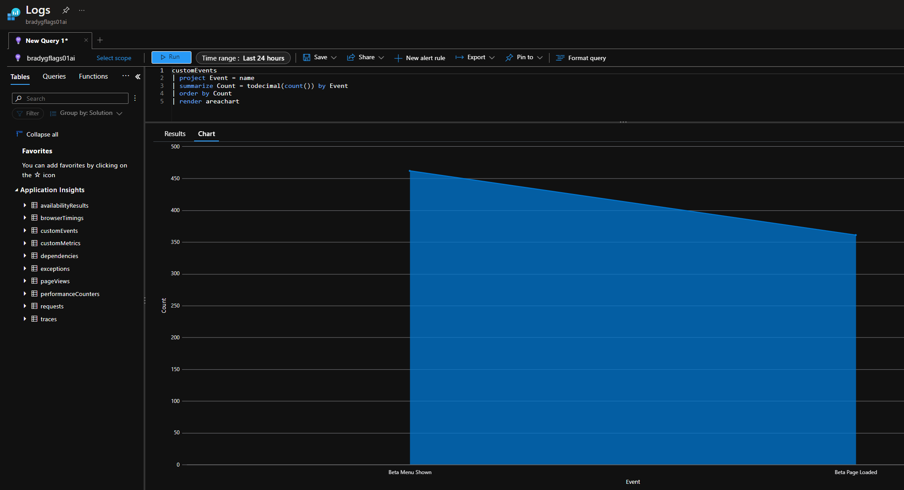

## Summary

This sample shows you how you can couple the awesome programmatic features and extensions to ASP.NET Core that make it a fantastic option for building cloud-native apps, that are easy to monitor and perform automated deployments of whenever changes arise. We hope this sample provides you some visibility into how you can couple various Azure services together with .NET to gradually ease in features with careful A/B testing and analysis using existing tools and APIs. 

> Note: Remember to clean up or scale back your resources to save on compute costs. 

Happy coding!
